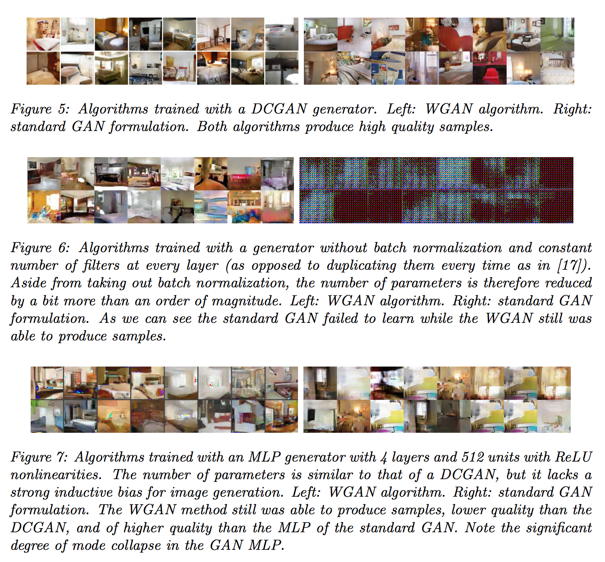

Generating synthetic fingerprints
===============
First, we need to do some preprocessing over our fingerprints. Our dataset is a little dirty, for example fingerprints are not alligned in the center of the images and they have lots of borders and stuff. Using the NBIS nfseq, we can crop them. Then, we can use the code of [WasserteinGan](https://github.com/martinarjovsky/WassersteinGAN) and do the modifications needed to input our dataset to it. After that, we can train our model and get result. Below you can see the readme for that repository. Also, you can use `crop_images_nfseq.py` script to crop all images. Just you need to install NBIS tools](https://www.nist.gov/itl/iad/image-group/products-and-services/image-group-open-source-server-nigos#Releases) beforehand and set path's correctly in the script.

# Wasserstein GAN

Code accompanying the paper ["Wasserstein GAN"](https://arxiv.org/abs/1701.07875)

## A few notes

- The first time running on the LSUN dataset it can take a long time (up to an hour) to create the dataloader. After the first run a small cache file will be created and the process should take a matter of seconds. The cache is a list of indices in the lmdb database (of LSUN)
- The only addition to the code (that we forgot, and will add, on the paper) are the [lines 163-166 of main.py](https://github.com/martinarjovsky/WassersteinGAN/blob/master/main.py#L163-L166). These lines act only on the first 25 generator iterations or very sporadically (once every 500 generator iterations). In such a case, they set the number of iterations on the critic to 100 instead of the default 5. This helps to start with the critic at optimum even in the first iterations. There shouldn't be a major difference in performance, but it can help, especially when visualizing learning curves (since otherwise you'd see the loss going up until the critic is properly trained). This is also why the first 25 iterations take significantly longer than the rest of the training as well.
- If your learning curve suddenly takes a big drop take a look at [this](https://github.com/martinarjovsky/WassersteinGAN/issues/2). It's a problem when the critic fails to be close to optimum, and hence its error stops being a good Wasserstein estimate. Known causes are high learning rates and momentum, and anything that helps the critic get back on track is likely to help with the issue.

## Prerequisites

- Computer with Linux or OSX
- [PyTorch](http://pytorch.org)
- For training, an NVIDIA GPU is strongly recommended for speed. CPU is supported but training is very slow.

Two main empirical claims:

### Generator sample quality correlates with discriminator loss


### Improved model stability




## Reproducing LSUN experiments

**With DCGAN:**

```bash
python main.py --dataset lsun --dataroot [lsun-train-folder] --cuda
```

**With MLP:**

```bash
python main.py --mlp_G --ngf 512
```

Generated samples will be in the `samples` folder.

If you plot the value `-Loss_D`, then you can reproduce the curves from the paper. The curves from the paper (as mentioned in the paper) have a median filter applied to them:

```python
med_filtered_loss = scipy.signal.medfilt(-Loss_D, dtype='float64'), 101)
```

More improved README in the works.
